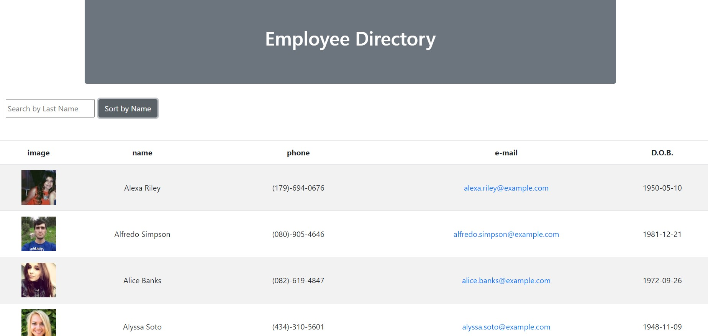
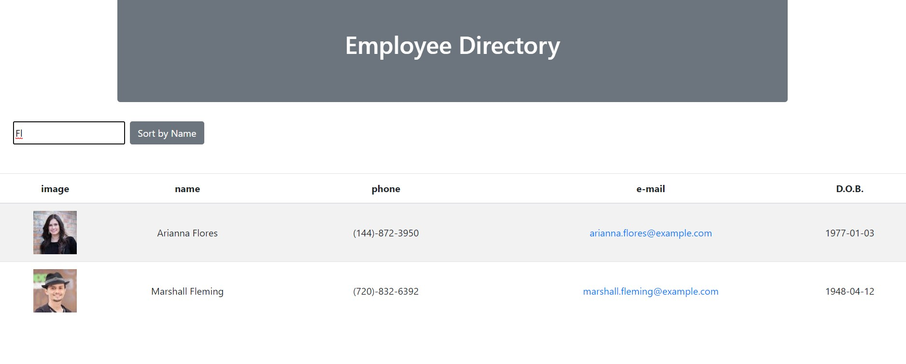

# Employee Directory
React app that dynamically displays a table of employee information as components
  
## Description
The React Employee Directory app allows for business professionals to access non-sensitive employee data and filter through them. Employers can search for specific employees from the search field at the top of the app as well as sort alphabetically.

## Live App
1. View the deployed app [here](https://hhutku.github.io/employeeDirectory/).

## Installation
* Clone the repo [here](https://github.com/hhutku/employeeDirectory) and run  ```npm install```
* Once you have repo cloned and dependencies installed, run  ```npm start``` in the command line to start server on localhost:3000.

### Screenshots




